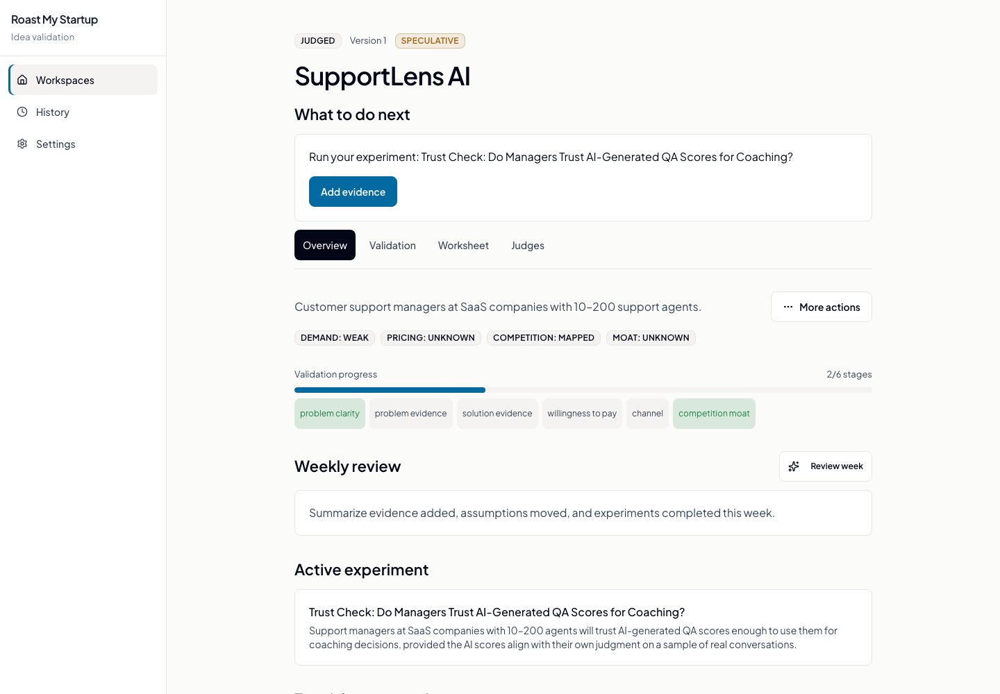
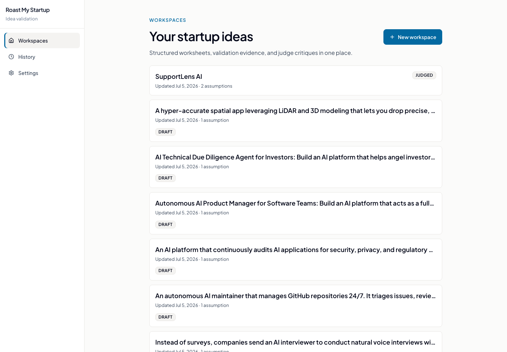
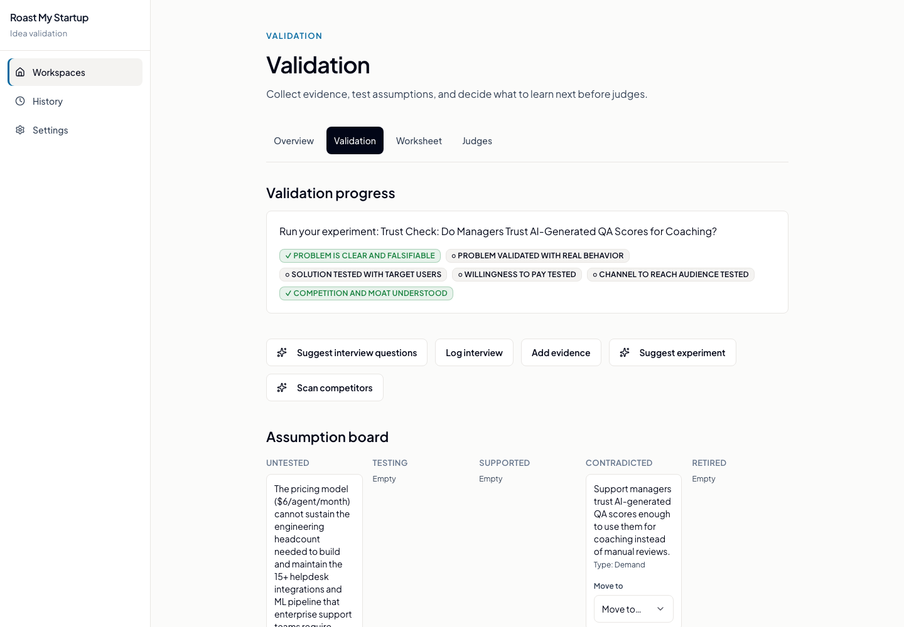
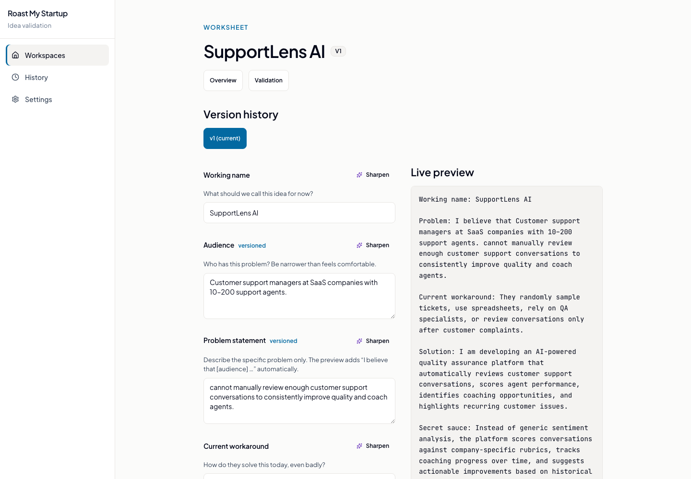
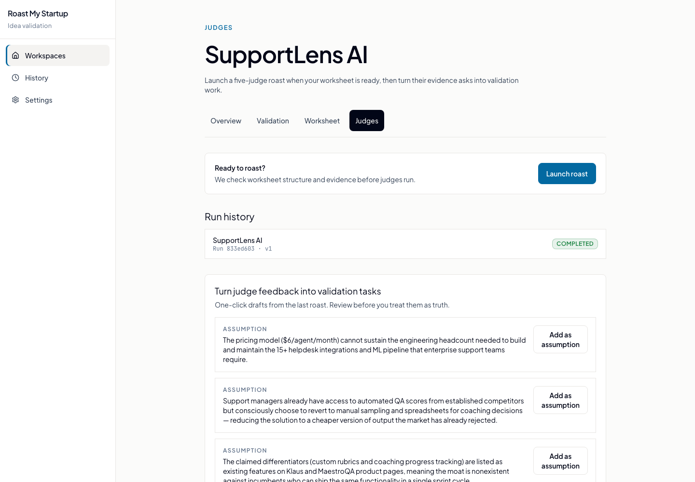
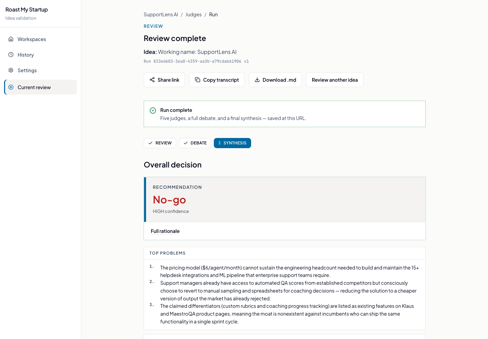
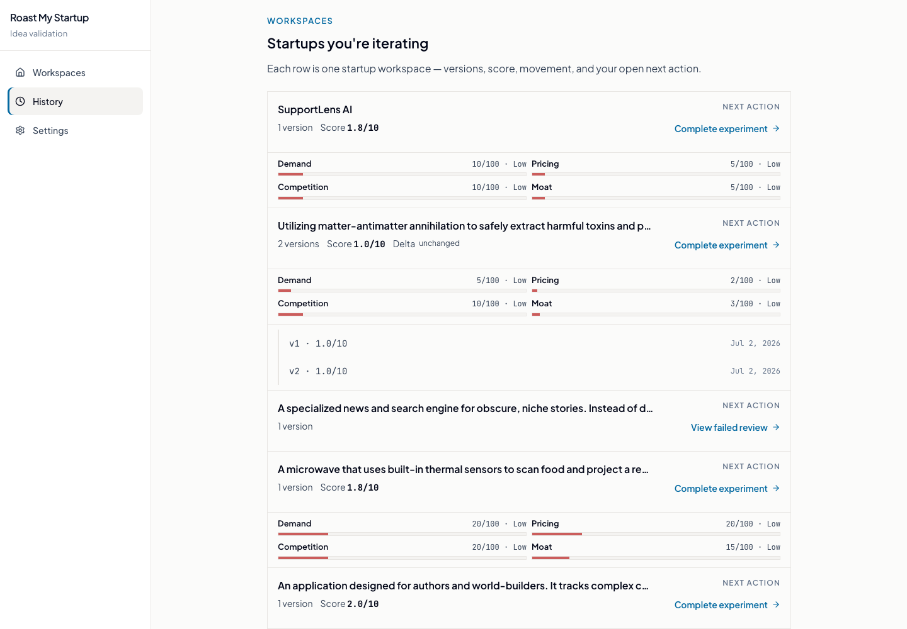

# Roast My Startup

> **Validate first. Five AI judges when you're ready. Zero sugarcoating.**

A founder workbench for stress-testing startup ideas. Capture a structured **Idea Validation Worksheet**, log assumptions and evidence, and run the roast panel only when a readiness gate says the pitch is specific enough. Five judges — VC, engineer, product manager, customer, and competitor — score independently, debate across multiple rounds, re-vote on the transcript, and a moderator delivers a structured GO / ITERATE / NO-GO call with actionable fixes. Verdicts flow back into validation as concrete next steps. Disagree? **Appeal with evidence** and make them reconsider.



| | |
| :--- | :--- |
| **Workspace** | Per-idea workbench: worksheet versions, lifecycle stage, linked judge runs, and exports |
| **Worksheet** | Guided Idea Validation fields (audience, problem, solution, pricing, risks) or paste-to-draft AI |
| **Validation** | Assumptions, evidence log, experiments, interviews, confidence score, and staged checklist |
| **Readiness gate** | Deterministic pre-judge checks; optional override with an AI readiness briefing |
| **Roast panel** | Five parallel verdicts: score, pass/fail, roast, key concern, recommended fix, evidence ask |
| **Debate** | Multi-round LangGraph argument with token streaming and every judge on the record |
| **Re-vote** | Post-debate re-score: judges revise verdicts after the full transcript (scores can move) |
| **Synthesis** | Structured GO / ITERATE / NO-GO recommendation with strengths, risks, and biggest disagreement |
| **Post-roast handoff** | Verdicts become validation tasks: assumptions, evidence targets, and experiment ideas |
| **Appeal** | Per-judge evidence coaching, optional judge targeting, revised scores and synthesis |
| **Iteration** | Worksheet versions plus linked judge runs; score and concern deltas vs prior versions |
| **Memory** | Past ideas inform future roasts (compact summaries; optional semantic retrieval) |
| **Web app** | Next.js workbench: workspace overview, validation board, judges launch, live SSE run view |
| **Web research** | Optional Tavily lookup with cited sources in the run view (API + Streamlit) |
| **Run metrics** | Per-phase latency (roast, debate, re-vote), token usage, and estimated cost (advanced view) |

## Quick start

**Requirements:** Python 3.11+ · [Ollama](https://ollama.com/) (local) or DeepSeek API (cloud)

```bash
git clone https://github.com/notsubash/roast-my-startup-idea.git
cd roast-my-startup-idea
pip install -r requirements.txt
ollama pull qwen3.5:9b          # default chat model; override in .env
ollama pull nomic-embed-text    # only if ENABLE_SEMANTIC_MEMORY=true
cp .env.example .env            # optional: DeepSeek, Tavily, LangSmith, semantic memory
```

### Web app (Next.js)

The `web/` frontend is the founder workbench. Start at `/workspaces/new` with the worksheet wizard (guided fields or paste notes for AI draft), then work through **Overview → Validation → Worksheet → Judges**. Log evidence and experiments, pass the readiness gate, launch a roast, watch judges debate and re-vote in real time, read structured synthesis, appeal with per-judge evidence coaching, and pull post-roast handoff items back into validation. Browse workspaces at `/workspaces` and run history at `/history`.

**Requirements:** Node.js 20+ · API on port 8000

```bash
# Terminal 1 — API
uvicorn api.app:app --app-dir src --reload --port 8000

# Terminal 2 — frontend
cd web
npm install
cp .env.example .env.local
npm run dev
```

Open [http://localhost:3000](http://localhost:3000). See [web/README.md](web/README.md) for OpenAPI type generation and frontend scripts.

### Streamlit (reference UI)

```bash
streamlit run src/app.py
```

Direct-submit reference UI: paste a pitch (optional details help judges), choose the model, and hit **Roast It!** Streamlit does not include the workspace/validation workbench — use the Next.js app for that. Streamlit also supports the experimental DeepAgents flow; the web app and streaming API use the deterministic pipeline only.

### Streaming API

The FastAPI backend powers the Next.js app and any custom frontend:

```bash
uvicorn api.app:app --app-dir src --reload --port 8000
```

Endpoints:

**Runs** (roast pipeline)

| Method | Path | Purpose |
| --- | --- | --- |
| `GET` | `/health` | Liveness check |
| `POST` | `/api/runs` | Create a run (`workspace_id` required; `parent_run_id` optional), returns `run_id` immediately |
| `GET` | `/api/runs` | Paginated run history (`limit`, `offset`) |
| `GET` | `/api/runs/{run_id}` | Poll run status |
| `GET` | `/api/runs/{run_id}/similar` | Similar past roasts (semantic or recency) |
| `GET` | `/api/runs/{run_id}/events` | SSE stream of roast/debate events |
| `GET` | `/api/runs/{run_id}/handoff` | Post-roast validation tasks (assumptions, evidence targets, experiments) |
| `POST` | `/api/runs/{run_id}/cancel` | Cooperatively stop a run (emits `run_cancelled`) |
| `POST` | `/api/runs/{run_id}/appeal` | Founder appeal (one per run; optional `target_judges`); returns revised panel |

**Workspaces** (validation workbench; prefix `/api/workspaces`)

| Method | Path | Purpose |
| --- | --- | --- |
| `POST` | `/api/workspaces` | Create workspace + initial worksheet version |
| `GET` | `/api/workspaces` | List workspaces |
| `GET` | `/api/workspaces/{id}` | Workspace detail + current worksheet |
| `GET` | `/api/workspaces/{id}/overview` | Validation progress, confidence, next action |
| `GET` | `/api/workspaces/{id}/readiness` | Pre-judge readiness checks |
| `GET` | `/api/workspaces/{id}/checklist` | Staged validation checklist |
| `POST` | `/api/workspaces/{id}/versions` | Save a new worksheet version |
| `GET` | `/api/workspaces/{id}/runs` | Judge runs linked to this workspace |
| CRUD | `/api/workspaces/{id}/assumptions` | Track testable assumptions |
| CRUD | `/api/workspaces/{id}/evidence` | Log interviews, metrics, LOIs, research |
| CRUD | `/api/workspaces/{id}/experiments` | Plan and record validation experiments |
| CRUD | `/api/workspaces/{id}/interviews` | Customer discovery notes |
| `POST` | `/api/workspaces/{id}/assist/*` | AI assists: draft, clarify, coach, weekly review, competitor scan, and more |
| `GET` | `/api/workspaces/{id}/export/markdown` | Export workspace as Markdown |
| `GET` | `/api/workspaces/{id}/export/judge-brief` | Export a judge-ready pitch brief |

Create a run with `workspace_id` (and optional `parent_run_id` / `readiness_override`), then open an `EventSource` (or equivalent) on `/api/runs/{run_id}/events`. The pitch text is compiled from the workspace worksheet. When web research is enabled, the stream may emit `research_findings` before roast events. The stream then emits ordered pipeline envelopes: roast and debate phases, optional `revote_started` / `revote_judge_completed` events, `debate_completed` (includes `structured_synthesis` and initial vs revised verdicts when re-vote ran), `run_metrics` (roast/debate/re-vote latency, token counts, estimated cost), then `run_completed`, `run_cancelled`, or `run_failed`. After completion, post-roast handoff items are available via `GET /api/runs/{run_id}/handoff`. After a successful appeal, an `appeal_completed` event is appended to the log (appeal itself is a REST call, not streamed).

The run engine is decoupled from the HTTP connection: `RunManager` drives the pipeline once into a durable SQLite event log (`data/runs.db`). Multiple tabs can watch the same run; disconnect and reconnect with the SSE `Last-Event-ID` header to resume without gaps. Heartbeat comment frames keep idle connections alive (`SSE_HEARTBEAT_SECONDS`, default 15s).

Set `ROAST_CORS_ORIGINS` in `.env` for your frontend origin (comma-separated). Default: `http://localhost:3000,http://127.0.0.1:3000`.

Run uvicorn with a single worker per machine; background tasks and in-process subscribers are not coordinated across workers yet.

**Rate limits:** `POST /api/runs` and `POST /api/runs/{run_id}/appeal` are token-bucket limited per client IP (`RATE_LIMIT_*` and `RATE_LIMIT_APPEAL_*` in `.env`). Returns `429` when exceeded. Disable with `RATE_LIMIT_ENABLED=false`. Set `TRUST_PROXY=true` only when the API sits behind a reverse proxy that sets `X-Forwarded-For` (Fly, Render, nginx). Otherwise clients could spoof that header to bypass limits.

**Run budget:** `MAX_RUN_SECONDS` (default 600) fails long runs cleanly between roast/debate boundaries and debate turns. In-flight judge LLM calls during roast may still finish after cancel/budget. Set `0` to disable.

**Cancel:** `POST /api/runs/{run_id}/cancel` is cooperative and asynchronous for running runs — the HTTP response may still show `status: "running"`. Poll `GET /api/runs/{run_id}` or watch SSE for the terminal `run_cancelled` event. Cancelling a `created` run (before SSE connect) is immediate.

### Docker (API + web)

```bash
cp .env.example .env   # set DEEPSEEK_API_KEY and/or point LOCAL_MODEL at host Ollama
docker compose up --build
```

- API: [http://localhost:8000/health](http://localhost:8000/health) → `{"status":"ok"}`
- Web: [http://localhost:3000](http://localhost:3000)

SQLite files (`runs.db`, `workspaces.db`, `ideas.db`) persist in the `roast-data` volume under `/data`. API only: `docker compose up --build api`.

For local Ollama from inside the container, point `LOCAL_MODEL` at `host.docker.internal` (compose sets `extra_hosts` for Linux). Or run the API on the host and skip Docker. Behind nginx or a PaaS load balancer, set `TRUST_PROXY=true` in `.env`.

## What it does

| Phase | What happens |
| --- | --- |
| **Worksheet** | Structured idea capture: audience, problem, workaround, solution, pricing, competitors, top risky assumption |
| **Validation** | Track assumptions, evidence, experiments, and interviews; staged checklist and confidence score |
| **Readiness** | Deterministic gate before judges (specificity, human evidence, worksheet completeness); optional override |
| **Roast panel** | Five judges (VC, Engineer, PM, Customer, Competitor) evaluate in parallel |
| **Debate** | LangGraph runs configurable multi-round debate with fixed turn order and live token streaming |
| **Re-vote** | Each judge re-scores against the full debate transcript (optional; `ENABLE_REVOTE`) |
| **Synthesis** | Moderator returns structured GO / ITERATE / NO-GO with strengths, risks, and biggest disagreement |
| **Handoff** | Verdict fields become validation tasks: assumptions to test, evidence targets, experiment suggestions |
| **Appeal** *(optional)* | Per-judge evidence coaching → founder rebuttal (optional judge targeting) → revised scores |
| **Iteration** *(optional)* | New worksheet versions and linked judge runs; compare scores, concerns, and fixes vs prior versions |
| **Memory** | Prior ideas summarized into future judge prompts (SQLite; optional semantic retrieval) |
| **Web research** | Optional Tavily search with cited sources when judges need factual context |
| **Metrics** | Wall-clock per phase (including re-vote), token counts, and estimated API cost (`run_metrics` event) |

Each judge returns structured output: score, pass/fail/conditional label, roast, key concern, recommended fix, and evidence that would change their verdict. The UI renders a decision card, judge cards with proof bars, re-vote score deltas, debate transcript, version comparison, post-roast handoff, and Markdown export.

## Screenshots

### App UI

| Workspaces | Workspace overview |
| --- | --- |
|  |  |

| Validation | Worksheet |
| --- | --- |
|  |  |

| Judges | Review complete |
| --- | --- |
|  |  |

| History | Observability |
| --- | --- |
|  |  |

## Architecture

Built with **LangGraph**, **LangChain**, **Ollama**, and the **DeepAgents SDK**. Two execution paths exist; only one is production-ready.

```text
Idea Validation Worksheet (workspace)
  → Validation loop: assumptions, evidence, experiments, interviews
  → Readiness gate
  → Phase 1: parallel structured judge calls (roast panel)
  → Phase 2: LangGraph debate graph
  → Phase 2b: post-debate re-vote (optional)
  → Moderator structured synthesis
  → Post-roast handoff → validation tasks
  → Optional appeal re-evaluation (against post-revote panel when present)
  → Worksheet revision → next version
  → Persist compact idea memory (with optional parent/version lineage)
```

**Deterministic pipeline** (`src/pipeline.py`): Direct model calls plus LangGraph guarantee all five judges speak, debate rounds advance predictably, and Pydantic validates every boundary. Debate streams token deltas (`DebateTokenDelta`) for live UI updates; re-vote streams `RevoteJudgeCompleted` with score deltas. At completion the pipeline emits `RunMetrics` (roast/debate/re-vote seconds, tokens, estimated cost) before `PipelineCompleted`.

**Decision-ready verdict** (`src/judges/synthesis.py`, extended `Verdict` schema): Judges return `recommended_fix` and `evidence_to_change_verdict`. The moderator returns a structured `Synthesis` (GO / ITERATE / NO-GO, confidence, top strengths/risks, biggest disagreement) with prose fallback. `assess_verdict_output_quality` flags degraded local-model output in the UI.

**Post-debate re-vote** (`src/debate/revote.py`): After debate, each judge revises their verdict against the full transcript. Guardrails cap score movement (`MAX_REVOTE_SCORE_DELTA`); `assess_revote_quality` detects herding and unexplained deltas. Appeal re-evaluates against the post-revote panel when present (`appeal_baseline_panel`).

**Pitch iteration** (`src/memory/lineage.py`, `src/validation/versioning.py`): Workspaces carry versioned worksheets (`WorksheetVersion` with `parent_version_id`). Judge runs link to a workspace and worksheet version. The web app compares score and concern deltas across versions and surfaces a primary next action from validation progress.

**Post-roast handoff** (`src/validation/ingest.py`): After a run completes, judge `recommended_fix`, `evidence_to_change_verdict`, and synthesis `top_problems` become `RunHandoffItem` records (assumptions, evidence targets, experiments). The workspace overview and judges page surface these for the next validation loop.

**Validation workbench** (`src/validation/`): Deterministic readiness, confidence, checklist, and staged progress (`problem_clarity` → `competition_moat`). CRUD for assumptions, evidence, experiments, and interviews in `data/workspaces.db`. LLM assists for worksheet draft/clarify, validation coach, readiness briefing, weekly review, competitor scan, interview questions, and experiment suggestions.

**Appeal coaching** (`src/appeal/coaching.py`, mirrored in `web/src/lib/appeal/coaching.ts`): Surfaces per-judge evidence asks above the appeal form. API accepts optional `target_judges`; response includes per-judge evidence outcomes.

**Run engine** (`src/api/run_manager.py`): Background task per run, durable event log in SQLite, subscriber-based SSE with reconnect support. Structured `run_metrics` JSON is logged once per API run (with `run_id`). API runs require a `workspace_id`, compile pitch text from the worksheet, persist to idea memory under a stable local user id, and support appeal, run history, similar-roast lookup, and post-roast handoff ingest.

**Web frontend** (`web/`): Next.js App Router workbench with workspace overview, validation board, worksheet wizard/editor, judges launch with readiness gate, live SSE run view, structured synthesis cards, re-vote score deltas, post-roast handoff, appeal coaching, related roasts, and workspace-grouped history.

**Verification** (`src/verification/`): Shared invariants and quality checks (score/verdict alignment, degenerate panels/fixes, re-vote quality) used by guardrails, eval scorers, and UI degradation hints.

**DeepAgents orchestrator** (`src/orchestrator/deep_agent.py`): Agent harness that dispatches subagents via `task()` with stronger tool-calling models. Streamlit-only; not exposed via the streaming API.

### Design principles

- **Orchestration over autonomy:** the debate is a workflow, not a free-form agent task. LangGraph owns state and routing.
- **Structured output at boundaries:** verdict and synthesis schemas in `src/judges/schemas.py` and `src/judges/synthesis.py` are the contract between phases, charts, memory, and exports. Post-validation guardrails in `src/judges/guardrails.py` and shared checks in `src/verification/` reject score/verdict mismatches, degenerate panels, and weak re-vote movement.
- **Untrusted user input:** startup idea, memory, research, and appeal text are wrapped in tagged blocks with delimiter escaping (`src/idea_context.py`); prompts treat that content as data, not instructions.
- **Compact memory:** SQLite stores full records, but prompts receive only short summaries (scores, concerns, synthesis). Full transcripts are never injected into judge prompts; local models drift under long context. Optional semantic retrieval (`sqlite-vector`) surfaces similar past ideas instead of only the most recent.
- **Appeal as a third phase:** re-evaluates judges against founder evidence (post-revote baseline when re-vote ran). Does not rerun the multi-round debate. Coaching surfaces what evidence each judge needs before the founder writes.
- **Debate that moves scores:** re-vote closes the loop so argument can change measurable outcomes, not just prose.

## Configuration

Copy `.env.example` to `.env`. Key variables:

```bash
LOCAL_MODEL=ollama:qwen3.5:9b
DEEPSEEK_MODEL=deepseek-v4-pro
DEEPSEEK_BASE_URL=https://api.deepseek.com
DEEPSEEK_API_KEY=your_deepseek_api_key
MAX_DEBATE_ROUNDS=3
ENABLE_WEB_SEARCH=false
WEB_SEARCH_MAX_RESULTS=3
TAVILY_API_KEY=your_tavily_api_key
ROAST_CORS_ORIGINS=http://localhost:3000,http://127.0.0.1:3000
SSE_HEARTBEAT_SECONDS=15
STALE_RUN_MINUTES=30
RUNS_DB_PATH=data/runs.db
RATE_LIMIT_ENABLED=true
RATE_LIMIT_REQUESTS=30
RATE_LIMIT_BURST=10
RATE_LIMIT_WINDOW_SECONDS=60
RATE_LIMIT_APPEAL_REQUESTS=5
RATE_LIMIT_APPEAL_BURST=2
RATE_LIMIT_APPEAL_WINDOW_SECONDS=60
LIST_RUNS_DEFAULT_LIMIT=20
LIST_RUNS_MAX_LIMIT=100
ENABLE_SEMANTIC_MEMORY=false
EMBEDDING_MODEL=ollama:nomic-embed-text
EMBEDDING_DIMENSION=768
ENABLE_REVOTE=true
MAX_REVOTE_SCORE_DELTA=3
```

| Runtime | When to use |
| --- | --- |
| `local` | Default. Ollama via `LOCAL_MODEL`. |
| `deepseek` | Cloud API via `DEEPSEEK_API_KEY` and `langchain_deepseek`. |

Pick a model with solid instruction-following and structured output. If verdict validation fails, try a stronger instruct or tool-calling model.

**Web research:** optional Tavily search, gated by a model policy prompt (not keyword matching).

**Semantic memory:** set `ENABLE_SEMANTIC_MEMORY=true` and pull the embedding model (`ollama pull nomic-embed-text` by default). When enabled, similar past ideas are retrieved via `sqlite-vector`; otherwise memory falls back to recency.

**Re-vote:** set `ENABLE_REVOTE=false` to skip post-debate re-scoring (rollback to pre-revote behavior). `MAX_REVOTE_SCORE_DELTA` caps how far each judge can move their score in one re-vote (default 3).

## LangSmith observability

Tracing is opt-in. Set credentials in `.env`:

```bash
LANGSMITH_TRACING=true
LANGSMITH_API_KEY=your_langsmith_api_key
LANGSMITH_PROJECT=roast-my-startup
```

Legacy `LANGCHAIN_TRACING_V2`, `LANGCHAIN_API_KEY`, and `LANGCHAIN_PROJECT` are also supported.

Traces cover roast panel calls, LangGraph debate, re-vote, appeal flows, and experimental DeepAgents runs. Metadata includes execution flow, app version, and a privacy-safe `idea_fingerprint` (SHA-256 hash + 80-char preview). Full startup text is never sent.

Filter by tags such as `phase:roast`, `phase:debate`, `phase:revote`, `phase:appeal`, or `flow:deterministic`.

**Run metrics (in-app):** the deterministic Streamlit path and API SSE stream surface per-run cost and latency without opening LangSmith — roast, debate, and re-vote wall-clock, token totals, and a static DeepSeek/local cost estimate from `src/observability/metrics.py`. Token counts use provider metadata when available, otherwise a chars÷4 fallback.

## Using the app

### Web app

1. Open [http://localhost:3000](http://localhost:3000) — redirects to `/workspaces/new`.
2. Create a workspace via the **worksheet wizard**: fill guided fields step-by-step, or paste rough notes and use **Draft from notes** AI. Sharpen individual fields with **Clarify**.
3. On the workspace **Overview**, follow the primary next action: plan interviews, add evidence, or continue validation stages.
4. Use **Validation** to manage assumptions, log evidence (interviews, metrics, LOIs), run experiments, and track staged progress.
5. Edit the pitch in **Worksheet**; each save creates a new version with a diff summary.
6. When readiness passes, open **Judges**, review the readiness briefing, and launch a roast. Advanced settings (model runtime, debate rounds, web research) live under **Settings**.
7. Watch the live run at `/run/{runId}`: roast panel, debate transcript, re-vote score changes, structured synthesis, and sources when research ran.
8. After completion, review per-judge **recommended fixes**, pull **post-roast handoff** items into validation, use **Appeal** with the evidence checklist (optionally target specific judges), browse **Related roasts**, or revisit from **History** (`/history`, grouped by workspace/lineage).
9. Revise the worksheet and re-run judges to iterate; version comparison shows what moved.

### Streamlit

1. Enter a startup idea (optionally expand **Optional details** for target customer, pricing, traction, and competitors).
2. Choose execution flow: **Deterministic (production)** or **DeepAgents (experimental)**.
3. Choose model runtime: **local** or **deepseek**.
4. Optionally enable **Web research (Tavily)**.
5. Review verdicts (including recommended fixes), radar chart, debate transcript, re-vote deltas, structured synthesis card, and the **run metrics** footer on deterministic runs.
6. Use **Refine this idea** to iterate on a pitch and see version-to-version score and concern deltas.
7. Use **Appeal Mode** with the per-judge evidence checklist (LOIs, pilots, buyer persona, not persuasion alone).
8. Download the Markdown transcript if needed (includes run metrics when available).

### Memory

Stored at `data/ideas.db`. Streamlit uses a stable local user id (`data/local_user_id` via `src/memory/identity.py`); API runs use the same id so memory and similar-roast lookup work across both UIs. Retrieval (`src/memory/retrieval.py`) prefers semantically similar past ideas when `ENABLE_SEMANTIC_MEMORY=true`; otherwise it uses the most recent entries. Context builder (`src/memory/context.py`) injects compact summaries (idea text, average score, top concerns, previous synthesis, appeal outcome). Full transcripts are never injected. The web app surfaces similar past roasts on the run page via `GET /api/runs/{run_id}/similar`.

### Appeal mode

Founder appeal is sent to all five judges with the original idea, their baseline verdict (post-revote panel when re-vote ran), moderator synthesis, optional memory context, and appeal text. Optional `target_judges` labels which evidence asks the founder is answering; every judge still re-scores. **Appeal coaching** surfaces each judge's evidence ask before submission. Each judge returns a fresh validated `Verdict`; the UI shows score deltas and whether targeted evidence was met.

### Pitch iteration

Workspaces version the Idea Validation Worksheet (`POST /api/workspaces/{id}/versions`). Judge runs link to a workspace and worksheet version via `workspace_id` and `worksheet_version_id`. Optional `parent_run_id` chains refined roasts within a workspace. The UI compares scores, concerns, and recommended-fix status against prior versions and derives the next validation or judge action from staged progress.

**Migrating legacy runs:** if you have pre-workspace runs in `data/runs.db`, run `python scripts/migrate_runs_to_workspaces.py` to group them into workspaces (use `--dry-run` first).

## Repository layout

```text
src/
  app.py                         Streamlit entry point (direct-submit reference UI)
  api/                           FastAPI streaming API (RunManager, WorkspaceStore, durable SSE log)
  pipeline.py                    Frontend-agnostic production pipeline
  config.py                      Model and app settings
  events.py                      Frontend-agnostic pipeline event types
  idea_context.py                Untrusted user-input wrapping for prompts
  judges/                        Schemas, guardrails, synthesis, single-judge service, panel
  debate/                        LangGraph graph, nodes, router, revote, state
  memory/                        SQLite store, semantic retrieval, lineage, prompt context
  appeal/                        Re-evaluation, synthesis, coaching hints
  validation/                    Workspaces, readiness, checklist, confidence, LLM assists, handoff ingest
  verification/                  Shared invariants and panel/re-vote quality checks
  research/                      Tavily web search (model-gated policy)
  orchestrator/deep_agent.py     Experimental DeepAgents path (Streamlit only)
  observability/                 LangSmith bootstrap; run cost/latency metrics (`metrics.py`)
  ui/streamlit_runner.py         Streamlit pipeline adapter + metrics footer
  utils/                         Parser fallback, radar chart, transcript export
web/                             Next.js workbench (see web/README.md)
scripts/                         One-off utilities (e.g. migrate_runs_to_workspaces.py)
docs/                            Feature specs and UX audits (see docs/feature-spec.md)
tests/                           Unit tests (unittest, fake models, no Ollama required)
evals/                           Regression evals and monthly audit (see evals/README.md)
```

## Development

```bash
pip install -r requirements-dev.txt
pre-commit install                # Ruff on every commit

python -m unittest discover -s tests
python -m compileall src
ruff check src tests evals
ruff format src tests evals
```

**Web frontend** (`web/`): `npm run lint`, `npm run test:reducer`, `npm run test:coaching`, `npm run test:synthesis`, `npm run test:judge-proof`, `npm run test:confidence`, `npm run test:experiment`, and `npm run build` (see [web/README.md](web/README.md)). Regenerate API types with `npm run gen:types` when backend schemas change.

**CI** (`.github/workflows/ci.yml`) runs on push/PR to `main`: Ruff lint and format, pinned deps, version resolution check, unit tests on Python 3.11-3.13, compile check.

**Evals:** see [evals/README.md](evals/README.md).

| Tier | When | Command |
| --- | --- | --- |
| 0 (CI) | Every PR | `python -m unittest discover -s tests` |
| 1 (Local) | Before prompt/model changes | `python -m evals.run_eval --runtime local --full` |
| 2 (DeepSeek audit) | Monthly (1st) or manual | `python -m evals.run_audit --no-reuse-last-local --baseline-only` |

Tier 1 checks structural reliability ($0, Ollama). Tier 2 uses one DeepSeek LLM-as-judge call per idea (~$0.50-2/month on committed baselines).

Version lives in `pyproject.toml` (`[project].version`); runtime reads it via `src/version.py`.

## Scope and limitations

Honest boundaries, not bugs. Current design:

- **Workspace-first web app:** the Next.js UI centers on workspaces and validation; Streamlit remains a direct-submit reference UI without workspace support.
- Memory identity is local-only, not account-based. A stable id in `data/local_user_id` is shared by Streamlit and the API.
- Semantic retrieval and similar-roast lookup are optional and local-only (`ENABLE_SEMANTIC_MEMORY=true`).
- Readiness gate blocks judge runs until the worksheet is specific enough; founders can override with `readiness_override` after reviewing checks.
- Appeal re-evaluates judges against the post-revote baseline when re-vote ran; it does not run a second multi-round debate. API runs allow one appeal per run.
- Re-vote quality depends on model instruction-following; weak local models may produce herded or unexplained score moves (the UI surfaces degradation hints).
- Pitch iteration is explicit (worksheet revision + re-run judges), not auto-detected via semantic similarity.
- SQLite storage is local-only (`data/workspaces.db` for workspaces, `data/ideas.db` for memory, `data/runs.db` for API runs).
- Streamlit supports the experimental DeepAgents flow; the web app and streaming API use the deterministic pipeline only.
- API runs need a single uvicorn worker per machine; multi-worker coordination is not implemented.
- DeepAgents is experimental, not the production orchestrator.

## Generated artifacts

```text
data/workspaces.db
data/ideas.db
data/runs.db
data/local_user_id
transcripts/*.md
roast_radar.png
```

Runtime outputs. Keep out of commits unless you intentionally want samples.